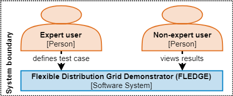
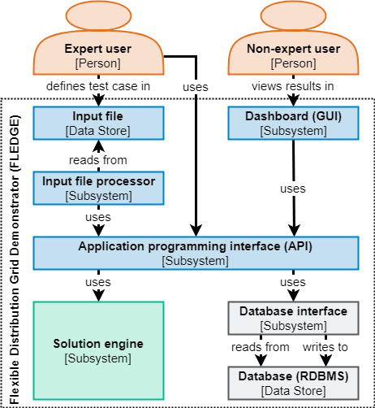
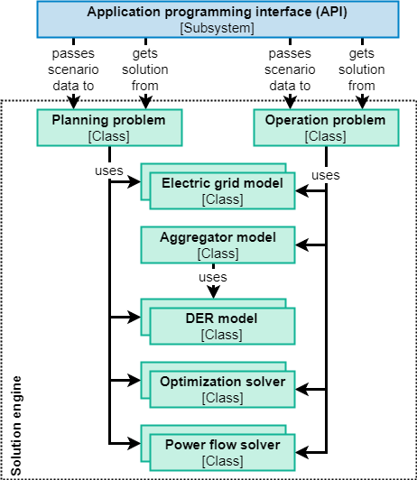
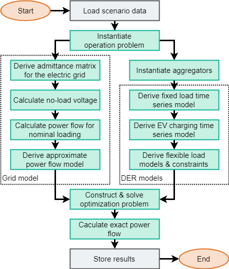

# Software Architecture

The software requirements and proposed software architecture for FLEDGE are discussed here to provide an overview for interested users and developers.

For the original publication on this topic, please refer to:

> Troitzsch, S., Hanif, S., Zhang, K., Trpovski, A., & Hamacher, T. (2019). Flexible Distribution Grid Demonstrator (FLEDGE): Requirements and Software Architecture. In IEEE PES General Meeting. Atlanta, GA, USA. (Preprint.) [[Researchgate]](https://www.researchgate.net/publication/328852562_Flexible_Distribution_Grid_Demonstrator_FLEDGE_Requirements_and_Software_Architecture)

## Preliminaries

Expert users and non-expert users are distinguished as stakeholders. Expert users are assumed to be trained with the software such that they are able to define test cases and scenarios, whereas non-expert users may be interested in the result of a scenario analysis without comprehending each asset of the distribution grid.

Optimization problems are distinguished into planning and operation problems. Optimal planning problems aim to determine the design, sizing or expansion plan for the distribution grid, whereas optimal operation problems focus on deriving the operation schedules, control signals or set points for flexible

## Problem Statement

In the advent of DERs, the distribution system operator (DSO) seeks to study the deployment of flexible resources in the distribution grid and the the benefit of cost-optimal planning and operation methodologies to manage its assets. Based on this analysis, the DSO may plan its future investments and day-to-day operations.

## Requirements

To make FLEDGE practically and scientifically relevant, the key requirements were identified through 1) interaction with government agencies, companies and research entities in the distribution grid sector in Singapore 2) and conducting an in-depth domain analysis, i.e., evaluating existing software and identifying relevant gaps required for operating active distribution grid. Furthermore, the requirements were also tuned by 3) prototyping, i.e., a working example was set up to identify key challenges. The requirements are grouped into functional and non-functional, i.e, qualitative, requirements.

### Functional requirements

- The software computes planning and operation problems for the distribution grid in the presence of DERs.
- The software comprises a framework to represent and compare different (numerical optimization) problem formulations for both planning an operation. This includes the ability to specify different objective functions, mathematical component models and constraints.
- The software can interface numerical optimization solvers as a tool for computing the planning and operation problems.
- The software comprises mathematical component models for the distribution grid, fixed loads, flexible loads, BESSs, EV charging and renewable generation.
- The software allows adding more mathematical component models at a later stage.
- The software allows computation of results on a scenario basis. A scenario defines the test case, problem type, problem formulation and solution parameters. The test case defines the distribution grid along with its connected DERs. The problem type is either planning or operation. The problem formulation describes which objective function, mathematical component models and constraints are being considered. Solution parameters define which solution algorithm is applied.
- The expert user is provided with an interface for a tabular input format to define scenarios along with the required test case and component model parameters.
- The expert user is provided with programmable interface for instructing the software to compute results for the scenarios from within a high-level programming language.
- The expert user is provided with results for each scenario in a tabular output format comprising the time series data of all state variables of all components.
- The non-expert user is provided with the ability select and view results for scenarios which have been defined by expert users.
- The non-expert user is provided with results for each scenario in a graphical user interface through visual representation of the distribution grid and its operational performance, i.e. nodal voltage, line loading, line losses and dispatched load and generation.

### Non-functional Requirements

- The solution mechanism is highly scalable, i.e., distributed optimization techniques are utilized to improve the computational performance for large-scale test cases.
- The solution mechanism accounts for multiphase unbalanced loading conditions in the distribution grid.
- The framework specifies a tabular input definition format for test case data, i.e., distribution grid layout, grid component parameters, DER connection points and DER parameters.
- The definition of the test case is separated from the mathematical definition of component model such that the test case is easily replaceable.
- The software makes it easy to reconfigure and re-run scenarios. Hence, the performance of the solution procedure is a major concern.
- The software should not depend on third-party software that would incur additional license fees.
- The software documentation enables expert users to comprehend the mathematical foundation of models and algorithms.
- The software documentation enables non-expert users to operate the software independently given a set of predefined scenarios.

## General Architecture

The fundamental subsystems of FLEDGE are defined based on the identified requirements. The input file is the interface for expert users to define test cases and scenarios. The dashboard is the graphical user interface for non-expert users to view the scenario results. The application programming interface (API) is the interface which enables the expert user to interact with FLEDGE. The test cases, scenarios and results are stored in a relational database management system (RDBMS) which is integrated through the database interface. The solution functionality is bundled into the solution engine, which comprises all mathematical models and solution algorithms.

The API provide methods for reading and updating the test case, scenario and result data as well as methods for invoking the solution engine. It provides a layer of abstraction to ensure that changes in one subsystem don't incur changes in others, e.g., the database interface can be changed without having to change the solution engine. Consequently, the API must be relatively stable throughout the software development to maintain compatibility.

The input file is imported to the database through the input file processor which interfaces with the API to import the test case and scenario data. The input file format may be changed by amending this processor, independent from the internal database structure. The dashboard is is the graphical user interface to present the non-expert user with scenario results. This subsystem also relies on API functions to load the results data. With this architecture, additional user interfaces can easily be deployed at a later point by interfacing the API. For example, a graphical editor may be provided which interacts with the API to manipulate the test case and scenario definition in the database.

A RDBMS is chosen as the internal storage solution, because it enables more efficient reading, writing, updating interactions then a file system. A persistent storage solution is preferred over in-memory storage to enable reviewing the results at a later time without repeatedly invoking the computationally intensive solution engine. Furthermore, the database can easily be centralized to allow concurrent access across multiple machines, e.g. to allow collaborative work on the test cases and scenarios.

## Solution Engine Architecture

The solution engine, i.e. all modules within `src/core/`, is the core subsystem of FLEDGE and is concerned with implementing the mathematical routines for solving planning and operation problems as above. At the top level, the classes for planning and operation problems are distinguished, as both problem types yield a different organization of the optimization problem. These classes construct the respective problem based on subordinate classes for the electric grid model and DER models as well as optimization solvers and simulation solvers. The operation problem class further considers a class for aggregators to adequately model the separated concerns between the DSO and aggregators.

The electric grid model classes implement the methods for deriving the power flow approximations for the optimization problem. Similarly, DER model classes provide methods for deriving the mathematical models for renewable generation, EV charging, flexible loads, fixed loads and BESSs. DER models take the form of 1) time series models for non-controllable assets and 2) state space models in the case of flexible resources. In the operation problem, DER model instances are not created in the central problem, but rather within the aggregator subproblem.

Optimization solver classes either 1) directly implement the optimization algorithm or 2) provide the interface to an existing solver, e.g., CPLEX or Gurobi.

Power flow solver classes implement solvers for the exact equations of the distribution grid power flow. The exact power flow solution is desired as a benchmark for the optimal power flow solution which was obtained with an approximate model. These classes may interface existing power flow solvers, e.g., OpenDSS.

## Use Case: Operation

Above figure describes the process flow for an exemplary operation problem in FLEDGE. The input files for defining the test case and scenario have already been imported to FLEDGE and the program is invoked by a call to the API seeking the solution of the scenario. First, the test case and scenario data is loaded through the database interface and an object of the operation problem class is instantiated. The test case and scenario data is passed to the operation problem during creation. Within the operation problem, the electric grid model, aggregator and DER model objects are instantiated, where each DER model object is associated with one aggregator. Once all models have been derived, the optimization problem is constructed and passed to the optimization solver. Lastly, the solution of the optimization problem is used to calculate the exact power flow. All results are stored in the database.
